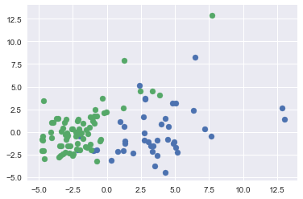

```python
%matplotlib inline

#https://github.com/blei-lab/edward/blob/master/examples/bayesian_logistic_regression.py
import matplotlib.pyplot as plt
import seaborn as sns
import tensorflow as tf
import edward as ed
import numpy as np
from edward.models import BernoulliWithSigmoidProbs, Normal
from sklearn.datasets import load_breast_cancer
from sklearn.model_selection import train_test_split
from sklearn.preprocessing import StandardScaler
from sklearn.decomposition import PCA
```

### Prepare the data


```python
X,y = load_breast_cancer(return_X_y=True)
```


```python
X.shape
```


    (569, 30)


```python
D = X.shape[1]
```


```python
X_train,X_test,y_train,y_test = train_test_split(X,y,test_size=0.20,stratify=y,random_state=0)
```


```python
scaler = StandardScaler()
X_train = scaler.fit_transform(X_train)
X_test = scaler.transform(X_test)
```

### Define the model


```python
X = tf.placeholder(tf.float32, [None,D])
w = Normal(loc=tf.zeros(D), scale=tf.ones(D))
b = Normal(loc=tf.zeros(1), scale=tf.ones(1))
y = Bernoulli(logits=ed.dot(X,w)+b)
```

### Set up variatonal inference


```python
qw = Normal(loc=tf.Variable(tf.random_normal([D])),
            scale=tf.nn.softplus(tf.Variable(tf.random_normal([D]))))
qb = Normal(loc=tf.Variable(tf.random_normal([1])),
            scale=tf.nn.softplus(tf.Variable(tf.random_normal([1]))))
```


```python
inference = ed.Laplace({w: qw, b: qb}, data={X: X_train, y: y_train})
inference.run(n_iter=500)
```

    500/500 [100%] ██████████████████████████████ Elapsed: 7s | Loss: 58.374
    

### Evaluation


```python
y_post = ed.copy(y, {w: qw, b: qb})
```


```python
print(ed.evaluate('binary_accuracy', data={X: X_test, y_post: y_test}))
```

    0.982456
    


```python
print(ed.evaluate('binary_accuracy', data={X: X_train, y_post: y_train}))
```

    0.989011
    

### Visualization in 2D

First, let's project the data onto its first two principal component, so we can plot the data:


```python
pca = PCA(n_components=2)
X_train_pca = pca.fit_transform(X_train)
X_test_pca = pca.transform(X_test)
```

The plot shows that the data is almost linearly separable based on the two first principal components


```python
plt.scatter(X_test_pca[np.where(y_test==0),0],X_test_pca[np.where(y_test==0),1])
plt.scatter(X_test_pca[np.where(y_test==1),0],X_test_pca[np.where(y_test==1),1])
```


    <matplotlib.collections.PathCollection at 0x79148fd0>





Let's repeat the modeling exercise from above on the PCA data:


```python
X = tf.placeholder(tf.float32, [None,2])
w = Normal(loc=tf.zeros(2), scale=tf.ones(2))
b = Normal(loc=tf.zeros(1), scale=tf.ones(1))
y = Bernoulli(logits=ed.dot(X,w)+b)

qw = Normal(loc=tf.Variable(tf.random_normal([2])),
            scale=tf.nn.softplus(tf.Variable(tf.random_normal([2]))))
qb = Normal(loc=tf.Variable(tf.random_normal([1])),
            scale=tf.nn.softplus(tf.Variable(tf.random_normal([1]))))

inference = ed.Laplace({w: qw, b: qb}, data={X: X_train_pca, y: y_train})
inference.run(n_iter=500)

y_post = ed.copy(y, {w: qw, b: qb})
```

    500/500 [100%] ██████████████████████████████ Elapsed: 7s | Loss: 55.586
    0.921053
    

We lose a little bit of accuracy due to the dimensionality reduction


```python
print(ed.evaluate('binary_accuracy', data={X: X_test_pca, y_post: y_test}))
```

Now, let's look at how we can use the infered distribution of the model parameters $w$ and $b$' to assess the fit of the model. Let's start by looking at the prior distribution:


```python
n_samples= 10
w_samples = w.sample([n_samples,2])[:, 0].eval()
b_samples = b.sample(n_samples).eval()
inputs = np.linspace(-5, 15, num=400)
for ns in range(n_samples):
    output =  -b_samples[ns]/w_samples[ns,1] - inputs * w_samples[ns,0]/w_samples[ns,1]
    plt.plot(inputs, output)
plt.scatter(X_test_pca[np.where(y_test==0),0],X_test_pca[np.where(y_test==0),1])
plt.scatter(X_test_pca[np.where(y_test==1),0],X_test_pca[np.where(y_test==1),1])
plt.xlim(-6,13)
plt.ylim(-6,13)
```


    (-6, 13)


Decision boundaries based on the prior are all over the place. It becomes more interesting for the posterior:


```python
n_samples= 10
w_samples = qw.sample([n_samples,2])[:, 0].eval()
b_samples = qb.sample(n_samples).eval()
inputs = np.linspace(-5, 15, num=400)
for ns in range(n_samples):
    output =  -b_samples[ns]/w_samples[ns,1] - inputs * w_samples[ns,0]/w_samples[ns,1]
    plt.plot(inputs, output)
plt.scatter(X_test_pca[np.where(y_test==0),0],X_test_pca[np.where(y_test==0),1])
plt.scatter(X_test_pca[np.where(y_test==1),0],X_test_pca[np.where(y_test==1),1])
plt.xlim(-6,13)
plt.ylim(-6,13)
```


    (-6, 13)


Sampling from the posterior, we can see that the model now has learned a narrow decision boundary. In particular, it becomes narrower around the bulk of the data.
